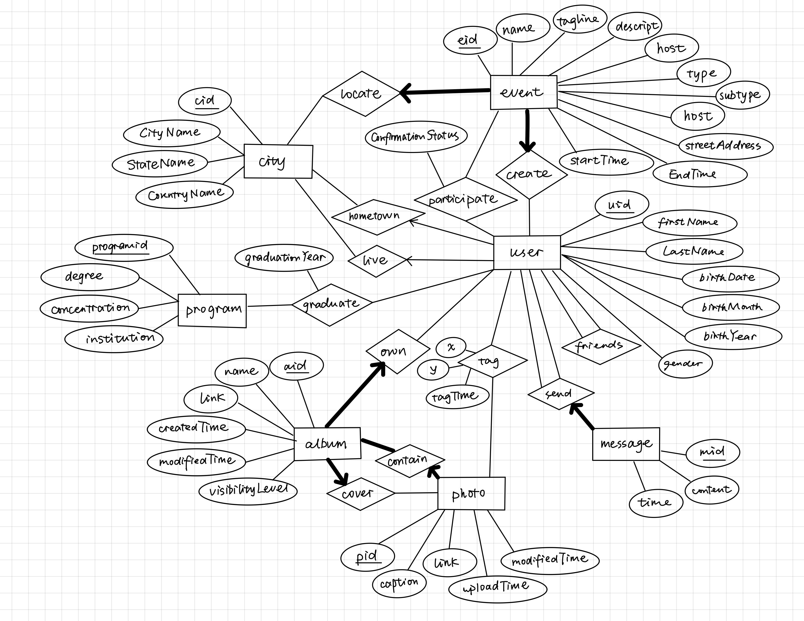

## Database Management System Project

### 1. Database Design and Implementation 

Design a relational database to store information for the fictional social media platform Fakebook, then build and populate the database in Oracle.

<a href="https://github.com/mengtzhou/eecs484-DBMS-project/tree/main/p1-database/db">See Code</a>

### 2. Java Database Connection

Build a Java application that executes SQL queries against a relational database and places the results in special data structures.

<a href="https://github.com/mengtzhou/eecs484-DBMS-project/blob/main/p2-query-JDBC/starter_code/project2/StudentFakebookOracle.java">See Code</a>
